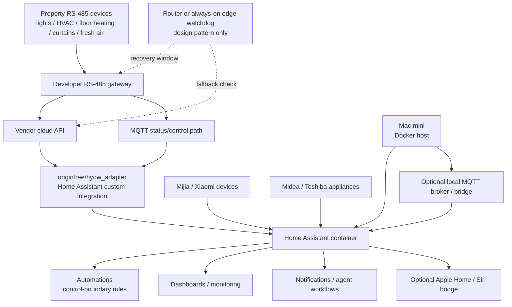

# HYQW × Home Assistant Home Operations Recipes

> Practical, privacy-preserving notes for operating a Home Assistant setup that bridges a property-developer RS-485 gateway with other smart-home ecosystems.

中文说明: [README.zh-CN.md](README.zh-CN.md)

## Attribution

This repository is **not** the original HYQW Home Assistant integration.

The core adapter used in the referenced deployment is the open-source project:

- Original project: [`origintree/hyqw_adapter`](https://github.com/origintree/hyqw_adapter)
- Original author / code owner: `@origintree`

This repository is a companion collection of **sanitized operational recipes, architecture notes, and Home Assistant automation templates** learned from a real deployment.

## Reference deployment scope

This repo is not just about installing one integration. In the referenced
deployment, the homeowner runs Home Assistant and supporting services as Docker
containers on a Mac mini, uses `origintree/hyqw_adapter` as the adapter layer for
the property-developer RS-485 system, then builds a broader Home Assistant
operations layer around it: Mijia / Xiaomi Home / Xiaomi Miot, Midea / Toshiba
appliances, Apple Home / Siri, automations, notifications, monitoring, and
recovery checks.

In short:

- `hyqw_adapter` brings the property RS-485 devices into Home Assistant;
- Mac mini + Docker acts as the host layer for Home Assistant and nearby
  services;
- this repo documents the whole-home operations layer above the adapter;
- the practical work includes multi-ecosystem integration, control-boundary
  design, state verification, recovery handling, Siri exposure strategy, and
  privacy-safe publishing;
- field deployment also surfaced upstream adapter compatibility issues, such as
  hard-coded validation values, `paho-mqtt` 2.x compatibility, and MQTT
  connection-loop behavior.

See [`docs/reference-deployment.md`](docs/reference-deployment.md).

For a Chinese field guide that explains what was built and how another homeowner
could approach a similar deployment, see
[`docs/implementation-playbook.zh-CN.md`](docs/implementation-playbook.zh-CN.md).
For Chinese notes on the upstream OpenWrt / DNS / MQTT bridge topology, see
[`docs/upstream-topology-notes.zh-CN.md`](docs/upstream-topology-notes.zh-CN.md).
For a Chinese field note on local MQTT first with automatic cloud fallback, see
[`docs/local-mqtt-cloud-fallback.zh-CN.md`](docs/local-mqtt-cloud-fallback.zh-CN.md).

## Architecture



The important boundary is that the upstream adapter handles protocol integration, while this repo documents the surrounding operational patterns: verification, recovery, control boundaries, and privacy-safe templates.

## What this repo contributes

The original adapter solves the essential integration problem. This repo focuses on the operational layer around it:

- production-style architecture for combining a property RS-485 gateway, Home Assistant, MQTT, and other smart-home ecosystems;
- safe control-boundary patterns, such as keeping a main power circuit on while leaving individual smart lights under manual control;
- power-failure recovery patterns for devices that restore to an undesirable default state;
- lighting ownership patterns for rooms that mix RS-485 circuits with Mijia or other smart lights;
- staged Xiaomi Home migration patterns with old-entity fallbacks;
- Midea / appliance reliability patterns for availability monitoring and verified reminders;
- conservative Apple Home / Siri exposure guidance;
- verification-first workflows for Home Assistant automations;
- documentation of pitfalls that are easy to miss in real homes.
- small, privacy-safe helper scripts for HA REST checks, sanitized entity snapshots, and leak scanning.

## Code examples

This repo now includes code, but only at the safe operational layer:

- [`scripts/ha_fresh_air_guard.py`](scripts/ha_fresh_air_guard.py): HA REST fallback guard for fresh-air recovery checks;
- [`scripts/ha_entity_snapshot.py`](scripts/ha_entity_snapshot.py): sanitized HA entity inventory exporter for documentation;
- [`scripts/sanitize_check.py`](scripts/sanitize_check.py): pre-publication leak scanner;
- [`examples/systemd/`](examples/systemd/): boot-time timer/service examples;
- [`.github/workflows/sanity.yml`](.github/workflows/sanity.yml): CI that compiles scripts and runs the leak scanner.

See [`docs/code-examples.md`](docs/code-examples.md).

## What is intentionally not included

To protect privacy and reduce copy-paste misuse, this repo intentionally excludes:

- cloud tokens, account IDs, device serial numbers, MQTT credentials, home IPs, domain names, and exact topic strings;
- exact room layouts, household routines, pairing codes, bridge ports, and advertised LAN addresses;
- captured binary payloads or `payload_hex` values;
- turnkey router watchdog code that can be directly repurposed as a commercial product;
- any vendor-private API credentials or proprietary data dumps;
- full Home Assistant `.storage` exports.

Where needed, examples use placeholders such as `<DEVICE_SN>`, `<MQTT_TOPIC>`, and `<ENTITY_ID>`.

## Repository structure

```text
docs/
  architecture.md              # sanitized architecture and boundaries
  apple-home-siri-exposure.md  # selective HomeKit / Siri exposure guidance
  code-examples.md              # privacy-safe helper scripts
  contribution-scope.md         # what belongs here vs upstream hyqw_adapter
  implementation-playbook.zh-CN.md # Chinese implementation playbook
  lighting-control-boundaries.md # mixed RS-485 + smart-light ownership model
  local-mqtt-cloud-fallback.zh-CN.md # Chinese local MQTT + cloud fallback pattern
  midea-appliance-reliability.md # Midea / appliance reliability patterns
  patterns.md                  # reusable HA/home ops patterns
  reference-deployment.md      # complete scope of the referenced deployment
  security-and-privacy.md       # sanitization and responsible sharing notes
  upstream-topology-notes.zh-CN.md # Chinese notes on upstream network topology
  xiaomi-home-migration.md      # staged Xiaomi Home migration pattern

scripts/
  ha_fresh_air_guard.py          # HA REST fallback guard; no vendor payloads
  ha_entity_snapshot.py          # sanitized HA entity inventory exporter
  sanitize_check.py              # pre-publication leak scanner

.github/
  workflows/sanity.yml           # compile + sanitization CI

examples/
  systemd/                       # boot-time guard timer/service examples

templates/
  home-assistant/
    kitchen-main-switch.yaml    # main-circuit keep-on pattern
    fresh-air-ha-guard.yaml     # HA-only fallback guard pattern
    lighting-scene-boundary.yaml # room scene with circuit precheck
    midea-availability-watch.yaml # appliance availability + completion patterns
    xiaomi-shadow-compare.yaml   # compare old/new Xiaomi entities during migration
  router-watchdog/
    README.md                   # design notes, not turnkey code
```

## License

Documentation and templates are released under **CC BY-NC-SA 4.0**. See [`LICENSE.md`](LICENSE.md).

This is intentionally non-commercial. If you want to use these materials in paid installation work, ask first and credit both this repo and the upstream adapter author.

## Responsible use

This material is for homeowners and Home Assistant hobbyists operating their own devices. Do not use it to access, control, or reverse-engineer systems you do not own or administer.
