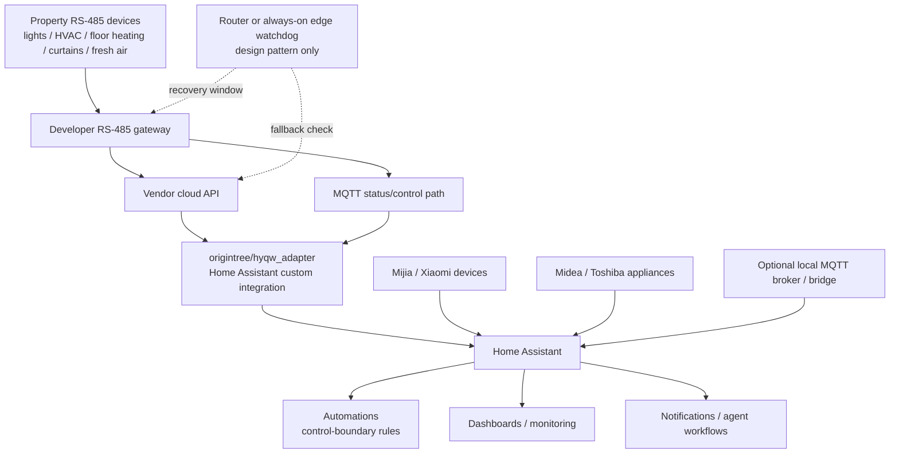

# HYQW × Home Assistant Home Operations Recipes

> Practical, privacy-preserving notes for operating a Home Assistant setup that bridges a property-developer RS-485 gateway with other smart-home ecosystems.

中文说明: [README.zh-CN.md](README.zh-CN.md)

## Attribution

This repository is **not** the original HYQW Home Assistant integration.

The core adapter used in the referenced deployment is the open-source project:

- Original project: [`origintree/hyqw_adapter`](https://github.com/origintree/hyqw_adapter)
- Original author / code owner: `@origintree`

This repository is a companion collection of **sanitized operational recipes, architecture notes, and Home Assistant automation templates** learned from a real deployment.

## Architecture



The important boundary is that the upstream adapter handles protocol integration, while this repo documents the surrounding operational patterns: verification, recovery, control boundaries, and privacy-safe templates.

## What this repo contributes

The original adapter solves the essential integration problem. This repo focuses on the operational layer around it:

- production-style architecture for combining a property RS-485 gateway, Home Assistant, MQTT, and other smart-home ecosystems;
- safe control-boundary patterns, such as keeping a main power circuit on while leaving individual smart lights under manual control;
- power-failure recovery patterns for devices that restore to an undesirable default state;
- verification-first workflows for Home Assistant automations;
- documentation of pitfalls that are easy to miss in real homes.

## What is intentionally not included

To protect privacy and reduce copy-paste misuse, this repo intentionally excludes:

- cloud tokens, account IDs, device serial numbers, MQTT credentials, home IPs, domain names, and exact topic strings;
- captured binary payloads or `payload_hex` values;
- turnkey router watchdog code that can be directly repurposed as a commercial product;
- any vendor-private API credentials or proprietary data dumps;
- full Home Assistant `.storage` exports.

Where needed, examples use placeholders such as `<DEVICE_SN>`, `<MQTT_TOPIC>`, and `<ENTITY_ID>`.

## Repository structure

```text
docs/
  architecture.md              # sanitized architecture and boundaries
  contribution-scope.md         # what belongs here vs upstream hyqw_adapter
  patterns.md                  # reusable HA/home ops patterns
  security-and-privacy.md       # sanitization and responsible sharing notes

templates/
  home-assistant/
    kitchen-main-switch.yaml    # main-circuit keep-on pattern
    fresh-air-ha-guard.yaml     # HA-only fallback guard pattern
  router-watchdog/
    README.md                   # design notes, not turnkey code
```

## License

Documentation and templates are released under **CC BY-NC-SA 4.0**. See [`LICENSE.md`](LICENSE.md).

This is intentionally non-commercial. If you want to use these materials in paid installation work, ask first and credit both this repo and the upstream adapter author.

## Responsible use

This material is for homeowners and Home Assistant hobbyists operating their own devices. Do not use it to access, control, or reverse-engineer systems you do not own or administer.
