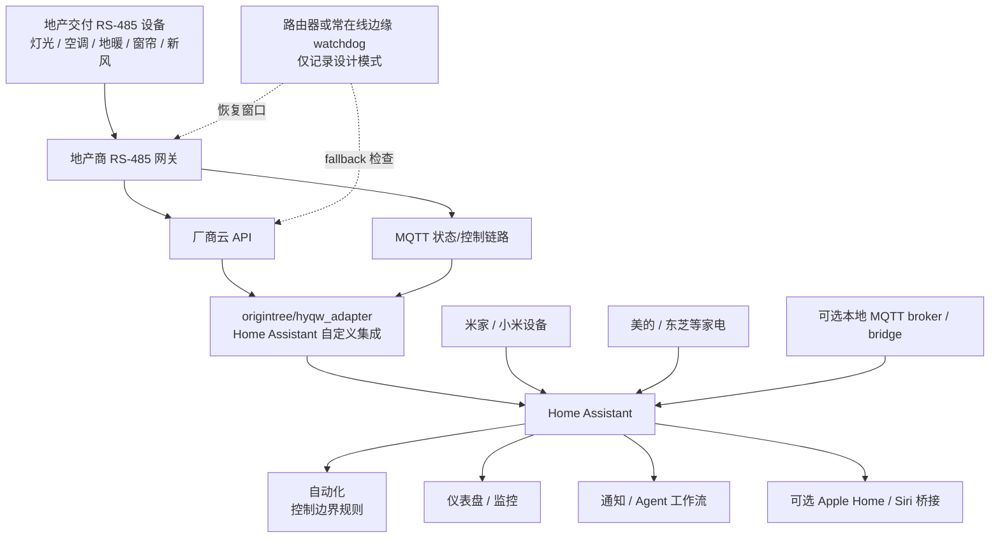

# HYQW × Home Assistant 家庭运维实践配方

> 一组去敏后的 Home Assistant 实战笔记，用于记录如何把地产商交付的 RS-485 智能家居网关，与米家、美的等生态一起接入 Home Assistant，并在真实家庭环境中稳定运行。

English: [README.md](README.md)

## 原作者署名

本仓库 **不是** 原始 HYQW Home Assistant 集成。

本仓库所参考的核心适配器来自以下开源项目：

- 原始项目：[`origintree/hyqw_adapter`](https://github.com/origintree/hyqw_adapter)
- 原作者 / code owner：`@origintree`

本仓库是一个 companion repo，主要整理**去敏后的运维经验、架构说明和 Home Assistant 自动化模板**。

## 架构图



这个架构里最重要的边界是：

- `origintree/hyqw_adapter` 负责协议适配和 HA 实体化；
- 本仓库负责记录外围的真实家庭运维模式，例如状态验证、断电恢复、控制权边界、自动化模板和隐私保护。

## 这个仓库贡献什么

原始 adapter 解决了核心接入问题。本仓库关注它周围的真实家庭落地问题：

- 如何把地产 485 网关、Home Assistant、MQTT、米家、美的等生态组合成稳定系统；
- 如何设计“控制边界”，例如一路开关保持供电，具体智能灯仍由物理/蓝牙开关控制；
- 如何处理断电后来电时某些设备恢复到错误默认状态；
- 如何处理地产 485 回路、米家智能灯和 HA 场景之间的灯光控制权边界；
- 如何低风险迁移 Xiaomi Miot / 米家实体到 Xiaomi Home，并保留 fallback；
- 如何把美的 / 东芝等家电的不稳定状态显性化，而不是假设云端状态永远可靠；
- 如何有选择地把 HA 设备暴露给 Apple Home / Siri；
- 如何在 Home Assistant 修改自动化后做写后验证，而不是只相信 API 返回成功；
- 记录真实家庭里容易踩坑、但官方文档通常不会覆盖的问题。
- 提供少量去敏后的辅助脚本，用于 HA REST 检查、实体清单去敏导出和发布前泄密扫描。

## 代码示例

现在仓库里不只是文档，也包含一层安全的工程代码：

- [`scripts/ha_fresh_air_guard.py`](scripts/ha_fresh_air_guard.py)：HA REST 新风恢复防护脚本；
- [`scripts/ha_entity_snapshot.py`](scripts/ha_entity_snapshot.py)：HA 实体清单去敏导出工具；
- [`scripts/sanitize_check.py`](scripts/sanitize_check.py)：发布前敏感信息扫描工具；
- [`examples/systemd/`](examples/systemd/)：开机后执行恢复检查的 timer/service 示例；
- [`.github/workflows/sanity.yml`](.github/workflows/sanity.yml)：编译脚本并运行敏感信息扫描的 CI。

这些代码只覆盖外围运维层，不包含真实厂商 API、设备 SN、MQTT topic 或 replay payload。详细说明见 [`docs/code-examples.md`](docs/code-examples.md)。

## 本仓库故意不包含什么

为了保护隐私，也为了避免被直接复制成商业交付包，本仓库故意不包含：

- 云端 token、账号 ID、设备序列号、MQTT 凭证、家庭 IP、域名、真实 topic；
- 真实户型、家庭作息、HomeKit 配对码、桥接端口和局域网广播地址；
- 抓包得到的二进制 payload 或 `payload_hex`；
- 可直接复制运行的路由器 watchdog 完整代码；
- 厂商私有 API 凭证或完整数据导出；
- Home Assistant `.storage` 文件。

需要举例时，统一使用占位符：

```text
<DEVICE_SN>
<MQTT_TOPIC>
<ENTITY_ID>
```

## 仓库结构

```text
docs/
  architecture.md              # 去敏架构和边界说明
  apple-home-siri-exposure.md  # Apple Home / Siri 选择性暴露策略
  code-examples.md              # 去敏后的辅助代码说明
  contribution-scope.md         # 本仓库与上游 hyqw_adapter 的分工
  lighting-control-boundaries.md # 485 回路 + 智能灯控制权边界
  midea-appliance-reliability.md # 美的 / 家电可靠性模式
  patterns.md                  # 可复用 HA / 家庭运维模式
  security-and-privacy.md       # 去敏和负责任分享说明
  xiaomi-home-migration.md      # Xiaomi Home 低风险迁移模式

scripts/
  ha_fresh_air_guard.py          # HA REST 新风恢复防护脚本，不含厂商 payload
  ha_entity_snapshot.py          # HA 实体清单去敏导出工具
  sanitize_check.py              # 发布前敏感信息扫描工具

.github/
  workflows/sanity.yml           # 编译 + 敏感信息扫描 CI

examples/
  systemd/                       # 开机恢复检查 timer/service 示例

templates/
  home-assistant/
    kitchen-main-switch.yaml    # 一路开关常亮模板
    fresh-air-ha-guard.yaml     # HA 侧新风恢复防护模板
    lighting-scene-boundary.yaml # 带回路预检查的房间场景模板
    midea-availability-watch.yaml # 家电可用性与完成提醒模板
    xiaomi-shadow-compare.yaml   # 米家新旧实体迁移对比模板
  router-watchdog/
    README.md                   # 设计说明，不提供可直接商用的脚本
```

## 示例模式

### 一路开关 vs 实体灯

有些精装系统里，地产 485 网关控制的是“一路电源/主回路”，而具体灯具本身可能是米家或其他智能灯。

正确做法是：

- 让一路开关在活动时间内保持打开，保证下游智能灯有电；
- 不要让 HA 自动化强行控制下游实体灯；
- 下游实体灯仍由用户习惯的蓝牙开关、墙面开关或 App 控制。

模板见：[`templates/home-assistant/kitchen-main-switch.yaml`](templates/home-assistant/kitchen-main-switch.yaml)

### 断电恢复防护

某些设备断电后来电会恢复到不理想状态，例如新风自动开启。若 HA 所在主机不能无人值守启动，则只靠 HA 自动化不够。

建议分层处理：

1. 优先寻找设备侧“上电默认关闭/掉电记忆”设置；
2. 如有必要，在路由器或常在线边缘设备上做短时间恢复窗口 watchdog；
3. HA 启动后再做 fallback 检查。

本仓库只记录设计模式，不发布真实 payload 和可直接复制的商用脚本。

## License

文档和模板采用 **CC BY-NC-SA 4.0**。详见 [`LICENSE.md`](LICENSE.md)。

这意味着：

- 可以分享和改编；
- 必须署名；
- 不得未经许可用于商业用途；
- 改编后需使用相同协议分享。

如果你希望把这些材料用于付费安装、商业交付或培训，请先取得许可，并同时注明上游 `origintree/hyqw_adapter`。

## 负责任使用

这些材料只面向管理自己家庭设备的业主和 Home Assistant 爱好者。请不要用它访问、控制或逆向你不拥有、不管理的系统。
